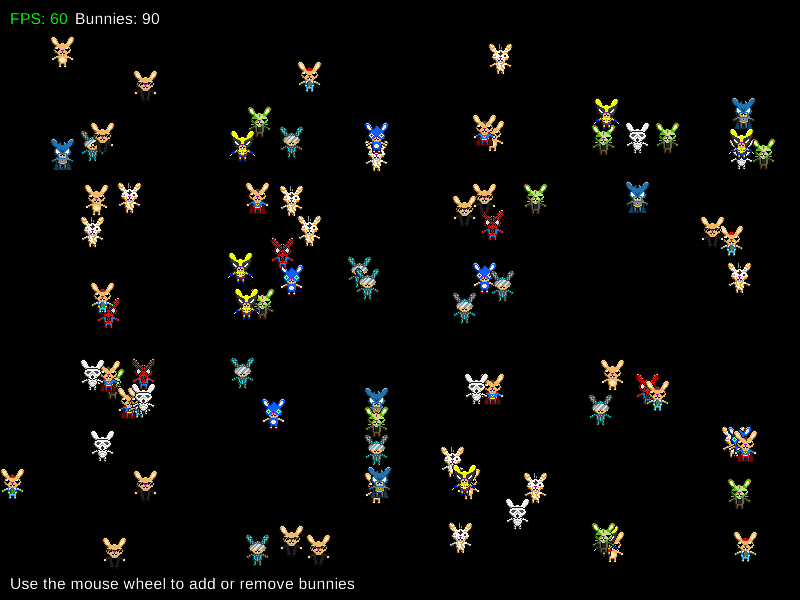

# Gosu BunnyMark



Benchmark for the Gosu game framework.

## Results

Running on my weak laptop.
Specs: 

```console
OS: Linux Mint 21.1 XFCE x86_64
Kernel: 5.15.0-91-generic
CPU: Intel Celeron N4020 (2) @ 2.800GHz
GPU: Intel GeminiLake [UHD Graphics 600]
RAM: 4GB
```

- 5000 bunnies: ~32fps
- 10 000 bunnies: ~17fps
- 20 000 bunnies: ~8fps
- 30 000 bunnies: ~5fps
- 40 000 bunnies: ~4fps
- 50 000 bunnies: ~3fps

## Run It

Clone the repo, and run `main.rb`.

## Controls

- Mouse wheel - Add or remove bunnies. 
- <kbd>0</kbd> - Remove all bunnies.
- <kbd>Escape</kbd> - Close the window.

## License

### Assets

I picked them from the internet, though I'm unsure about the license, some other
open-source projects seem to use them so I guess it's safe. Anyhow if you're the 
owner of the assets and want me to take them down please contact me.

### Code

This project is available under the [MIT License](/LICENSE).